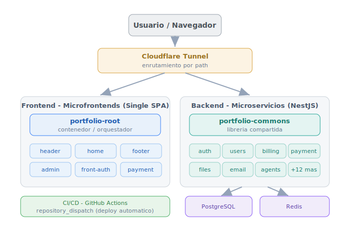

<h1 align="center">Hola, soy Javier Cardona</h1>
<h3 align="center">Desarrollador Full-Stack · Backend & Integración de IA</h3>

  
  
  

---

## 🚀 Sobre mí

Desarrollador Full-Stack con **+8 años de experiencia** construyendo aplicaciones web
y arquitecturas backend escalables. Diseño sistemas de punta a punta: del microfrontend
al microservicio, del CI/CD al despliegue self-hosted.

- 🔭 Trabajo a diario con **TypeScript, NestJS, React, Angular y Next.js**.
- 🏗️ Me apasiona la **arquitectura de microservicios** y los **microfrontends**.
- 🤖 Construyo **agentes de IA** y automatizaciones con n8n y modelos LLM locales (Ollama).
- 💳 Experiencia en **pasarelas de pago** en producción (Stripe, ePayco).
- 🌐 Todo mi portafolio corre en infraestructura **self-hosted** que administro yo.

## 🛠️ Stack tecnológico

## 🏗️ Mi portafolio es una plataforma completa

No es una colección de demos sueltos: es un sistema real, con **~18 microservicios**,
microfrontends independientes y despliegue automatizado.

- **Frontend (Single SPA):** `portfolio-root` orquesta microfrontends independientes
  (header, home, admin, auth, payment…), desplegables por separado.
- **Backend (NestJS):** `portfolio-commons` aporta utilidades transversales a todos los
  servicios (auth, users, billing, payment, files, email, agents, webhooks…).
- **Infra:** Cloudflare Tunnel con enrutamiento por path, PostgreSQL, Redis y Docker,
  con CI/CD automatizado vía `repository_dispatch`.

## 🌐 Organizaciones del portafolio

| Organización | Contenido |
|--------------|-----------|
| 🎨 **[JCDevPortfolio](https://github.com/JCDevPortfolio)** | Microfrontends (Single SPA) — la capa de frontend |
| ⚙️ **[JCDevPortfolio-Back](https://github.com/JCDevPortfolio-Back)** | Microservicios (NestJS) — el backend |

## 📌 Proyectos destacados

- 🤖 **[Agente de IA para finanzas personales](https://github.com/JCDevPortfolio-Back/portfolio-agents)** —
  cataloga transacciones bancarias desde Gmail con un LLM local (Ollama + n8n + PostgreSQL).
- 💳 **Plataforma de microservicios con facturación Stripe** —
  webhooks en producción y manejo centralizado de errores.
- 🎨 **[Design System / Storybook](https://storybook.javiercardona.dev)** —
  sistema de diseño compartido entre los microfrontends.

## 📫 ¿Hablamos?

  🌐 <a href="https://javiercardona.dev">javiercardona.dev</a> &nbsp;·&nbsp;
  ✉️ javiercardona.dev@gmail.com

Abierto a oportunidades remotas e híbridas como Desarrollador Full-Stack / Backend.

<!-- profile-readme -->
